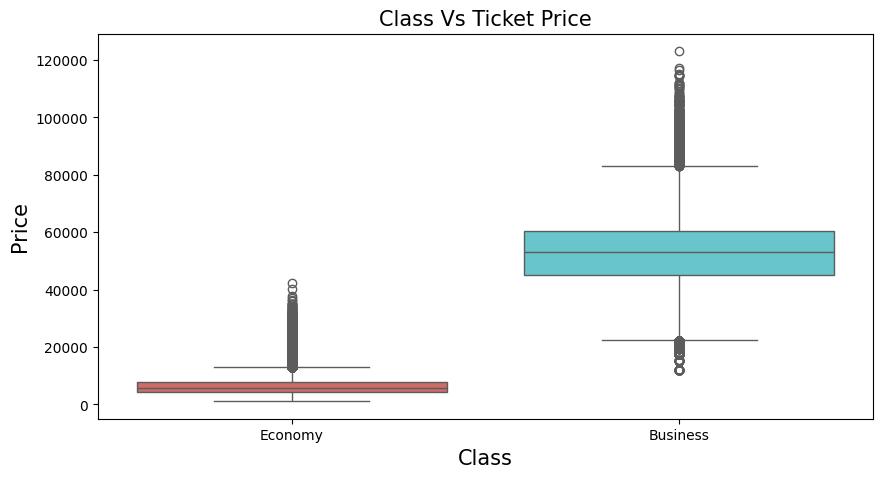

```python
import pandas as pd
import numpy as np
import matplotlib.pyplot as plt
import seaborn as sns

from sklearn.preprocessing import LabelEncoder
from sklearn.model_selection import train_test_split
from sklearn.preprocessing import MinMaxScaler
#libraries for ML models
from sklearn.linear_model import LinearRegression
from sklearn.tree import DecisionTreeRegressor
from sklearn.ensemble import BaggingRegressor, RandomForestRegressor, GradientBoostingRegressor, ExtraTreesRegressor
from sklearn.svm import SVR
from sklearn.neighbors import KNeighborsRegressor
from sklearn.model_selection import train_test_split
from sklearn import metrics
from sklearn.linear_model import Ridge, Lasso
import xgboost as xgb
from sklearn import linear_model
from sklearn.neighbors import KNeighborsRegressor
from sklearn.ensemble import ExtraTreesRegressor
from sklearn.ensemble import BaggingRegressor
from sklearn.ensemble import GradientBoostingRegressor

#librries used for ignore warnings 
import warnings
warnings.filterwarnings('ignore')
%matplotlib inline
```


```python
clean=pd.read_csv(r"C:\Users\lakshita\Desktop\datasets\flight_Clean_Dataset.csv")
```


```python
clean.head()
```


<div>
<style scoped>
    .dataframe tbody tr th:only-of-type {
        vertical-align: middle;
    }

    .dataframe tbody tr th {
        vertical-align: top;
    }

    .dataframe thead th {
        text-align: right;
    }
</style>
<table border="1" class="dataframe">
  <thead>
    <tr style="text-align: right;">
      <th></th>
      <th>Unnamed: 0</th>
      <th>airline</th>
      <th>flight</th>
      <th>source_city</th>
      <th>departure_time</th>
      <th>stops</th>
      <th>arrival_time</th>
      <th>destination_city</th>
      <th>class</th>
      <th>duration</th>
      <th>days_left</th>
      <th>price</th>
    </tr>
  </thead>
  <tbody>
    <tr>
      <th>0</th>
      <td>0</td>
      <td>SpiceJet</td>
      <td>SG-8709</td>
      <td>Delhi</td>
      <td>Evening</td>
      <td>zero</td>
      <td>Night</td>
      <td>Mumbai</td>
      <td>Economy</td>
      <td>2.17</td>
      <td>1</td>
      <td>5953</td>
    </tr>
    <tr>
      <th>1</th>
      <td>1</td>
      <td>SpiceJet</td>
      <td>SG-8157</td>
      <td>Delhi</td>
      <td>Early_Morning</td>
      <td>zero</td>
      <td>Morning</td>
      <td>Mumbai</td>
      <td>Economy</td>
      <td>2.33</td>
      <td>1</td>
      <td>5953</td>
    </tr>
    <tr>
      <th>2</th>
      <td>2</td>
      <td>AirAsia</td>
      <td>I5-764</td>
      <td>Delhi</td>
      <td>Early_Morning</td>
      <td>zero</td>
      <td>Early_Morning</td>
      <td>Mumbai</td>
      <td>Economy</td>
      <td>2.17</td>
      <td>1</td>
      <td>5956</td>
    </tr>
    <tr>
      <th>3</th>
      <td>3</td>
      <td>Vistara</td>
      <td>UK-995</td>
      <td>Delhi</td>
      <td>Morning</td>
      <td>zero</td>
      <td>Afternoon</td>
      <td>Mumbai</td>
      <td>Economy</td>
      <td>2.25</td>
      <td>1</td>
      <td>5955</td>
    </tr>
    <tr>
      <th>4</th>
      <td>4</td>
      <td>Vistara</td>
      <td>UK-963</td>
      <td>Delhi</td>
      <td>Morning</td>
      <td>zero</td>
      <td>Morning</td>
      <td>Mumbai</td>
      <td>Economy</td>
      <td>2.33</td>
      <td>1</td>
      <td>5955</td>
    </tr>
  </tbody>
</table>
</div>


```python
# Droping the useless column 'Unnamed: 0'
clean=clean.drop('Unnamed: 0',axis=1)
```


```python
clean.info()
```

    <class 'pandas.core.frame.DataFrame'>
    RangeIndex: 300153 entries, 0 to 300152
    Data columns (total 11 columns):
     #   Column            Non-Null Count   Dtype  
    ---  ------            --------------   -----  
     0   airline           300153 non-null  object 
     1   flight            300153 non-null  object 
     2   source_city       300153 non-null  object 
     3   departure_time    300153 non-null  object 
     4   stops             300153 non-null  object 
     5   arrival_time      300153 non-null  object 
     6   destination_city  300153 non-null  object 
     7   class             300153 non-null  object 
     8   duration          300153 non-null  float64
     9   days_left         300153 non-null  int64  
     10  price             300153 non-null  int64  
    dtypes: float64(1), int64(2), object(8)
    memory usage: 25.2+ MB
    


```python
clean.describe()
```


<div>
<style scoped>
    .dataframe tbody tr th:only-of-type {
        vertical-align: middle;
    }

    .dataframe tbody tr th {
        vertical-align: top;
    }

    .dataframe thead th {
        text-align: right;
    }
</style>
<table border="1" class="dataframe">
  <thead>
    <tr style="text-align: right;">
      <th></th>
      <th>duration</th>
      <th>days_left</th>
      <th>price</th>
    </tr>
  </thead>
  <tbody>
    <tr>
      <th>count</th>
      <td>300153.000000</td>
      <td>300153.000000</td>
      <td>300153.000000</td>
    </tr>
    <tr>
      <th>mean</th>
      <td>12.221021</td>
      <td>26.004751</td>
      <td>20889.660523</td>
    </tr>
    <tr>
      <th>std</th>
      <td>7.191997</td>
      <td>13.561004</td>
      <td>22697.767366</td>
    </tr>
    <tr>
      <th>min</th>
      <td>0.830000</td>
      <td>1.000000</td>
      <td>1105.000000</td>
    </tr>
    <tr>
      <th>25%</th>
      <td>6.830000</td>
      <td>15.000000</td>
      <td>4783.000000</td>
    </tr>
    <tr>
      <th>50%</th>
      <td>11.250000</td>
      <td>26.000000</td>
      <td>7425.000000</td>
    </tr>
    <tr>
      <th>75%</th>
      <td>16.170000</td>
      <td>38.000000</td>
      <td>42521.000000</td>
    </tr>
    <tr>
      <th>max</th>
      <td>49.830000</td>
      <td>49.000000</td>
      <td>123071.000000</td>
    </tr>
  </tbody>
</table>
</div>


```python
clean.select_dtypes(include=[np.number]).corr().T
```


<div>
<style scoped>
    .dataframe tbody tr th:only-of-type {
        vertical-align: middle;
    }

    .dataframe tbody tr th {
        vertical-align: top;
    }

    .dataframe thead th {
        text-align: right;
    }
</style>
<table border="1" class="dataframe">
  <thead>
    <tr style="text-align: right;">
      <th></th>
      <th>duration</th>
      <th>days_left</th>
      <th>price</th>
    </tr>
  </thead>
  <tbody>
    <tr>
      <th>duration</th>
      <td>1.000000</td>
      <td>-0.039157</td>
      <td>0.204222</td>
    </tr>
    <tr>
      <th>days_left</th>
      <td>-0.039157</td>
      <td>1.000000</td>
      <td>-0.091949</td>
    </tr>
    <tr>
      <th>price</th>
      <td>0.204222</td>
      <td>-0.091949</td>
      <td>1.000000</td>
    </tr>
  </tbody>
</table>
</div>


```python
clean.shape
```


    (300153, 11)


```python
clean1=clean.groupby(['flight','airline'],as_index=False).count()
clean1.airline.value_counts()
```


    airline
    Indigo       704
    Air_India    218
    GO_FIRST     205
    SpiceJet     186
    Vistara      133
    AirAsia      115
    Name: count, dtype: int64


```python
plt.figure(figsize=(8,5))
sns.countplot(clean1['airline'],palette='hls')
plt.title('Flights Count of Different Airlines',fontsize=15)
plt.xlabel('Count',fontsize=15)
plt.ylabel('Airline',fontsize=15)
plt.show()
```


    

    


```python
clean2=clean.groupby(['flight','airline','class'],as_index=False).count()
clean2['class'].value_counts()
```


    class
    Economy     1560
    Business     295
    Name: count, dtype: int64


```python
plt.figure(figsize=(8,6))
clean2['class'].value_counts().plot(kind='pie',textprops={'color':'black'},autopct='%.2f',cmap='cool')
plt.title('Classes of Different Airlines',fontsize=15)
plt.legend(['Economy','Business'])
plt.show()
```


    

    


```python
plt.figure(figsize=(15,10))
sns.boxplot(x=clean['airline'],y=clean['price'],palette='hls')
plt.title('Airlines Vs Price',fontsize=15)
plt.xlabel('Airline',fontsize=15)
plt.ylabel('Price',fontsize=15)
plt.show()
```


    

    


```python
plt.figure(figsize=(10,5))
sns.boxplot(x=clean['class'],y=clean['price'],data=clean,palette='hls')
plt.title('Class Vs Ticket Price',fontsize=15)
plt.xlabel('Class',fontsize=15)
plt.ylabel('Price',fontsize=15)
plt.show()
```


    

    


```python
plt.figure(figsize=(10,5))
sns.boxplot(x='stops',y='price',data=clean,palette='hls')
plt.title('Stops Vs Ticket Price',fontsize=15)
plt.xlabel('Stops',fontsize=15)
plt.ylabel('Price',fontsize=15)
plt.show()
```


    

    


```python
plt.figure(figsize=(24,10))
plt.subplot(1,2,1)
sns.boxplot(x='departure_time',y='price',data=clean)
plt.title('Departure Time Vs Ticket Price',fontsize=20)
plt.xlabel('Departure Time',fontsize=15)
plt.ylabel('Price',fontsize=15)
plt.subplot(1,2,2)
sns.boxplot(x='arrival_time',y='price',data=clean,palette='hls')
plt.title('Arrival Time Vs Ticket Price',fontsize=20)
plt.xlabel('Arrival Time',fontsize=15)
plt.ylabel('Price',fontsize=15)
plt.show()
```


    

    


```python
plt.figure(figsize=(24,10))
plt.subplot(1,2,1)
sns.boxplot(x='source_city',y='price',data=clean)
plt.title('Source City Vs Ticket Price',fontsize=20)
plt.xlabel('Source City',fontsize=15)
plt.ylabel('Price',fontsize=15)
plt.subplot(1,2,2)
sns.boxplot(x='destination_city',y='price',data=clean,palette='hls')
plt.title('Destination City Vs Ticket Price',fontsize=20)
plt.xlabel('Destination City',fontsize=15)
plt.ylabel('Price',fontsize=15)
plt.show()
```


    

    


```python
plt.style.use('dark_background')
plt.figure(figsize=(20,8))
sns.lineplot(data=clean,x='duration',y='price',hue='class',palette='hls')
plt.title('Ticket Price Versus Flight Duration Based on Class',fontsize=20)
plt.xlabel('Duration',fontsize=15)
plt.ylabel('Price',fontsize=15)
plt.show()
```


    

    


```python
plt.figure(figsize=(20,8))
sns.lineplot(data=clean,x='days_left',y='price',color='blue')
plt.title('Days Left For Departure Versus Ticket Price',fontsize=20)
plt.xlabel('Days Left for Departure',fontsize=15)
plt.ylabel('Price',fontsize=15)
plt.show()
```


    

    


```python
plt.figure(figsize=(20,8))
sns.lineplot(data=clean,x='days_left',y='price',color='blue',hue='airline',palette='hls')
plt.title('Days Left For Departure Versus Ticket Price of each Airline',fontsize=15)
plt.legend(fontsize=12)
plt.xlabel('Days Left for Departure',fontsize=15)
plt.ylabel('Price',fontsize=15)
plt.show()
```


    

    


```python
clean.groupby(['flight','source_city','destination_city','airline','class'],as_index=False).count().groupby(['source_city','destination_city'],as_index=False)['flight'].count().head(10)
```


<div>
<style scoped>
    .dataframe tbody tr th:only-of-type {
        vertical-align: middle;
    }

    .dataframe tbody tr th {
        vertical-align: top;
    }

    .dataframe thead th {
        text-align: right;
    }
</style>
<table border="1" class="dataframe">
  <thead>
    <tr style="text-align: right;">
      <th></th>
      <th>source_city</th>
      <th>destination_city</th>
      <th>flight</th>
    </tr>
  </thead>
  <tbody>
    <tr>
      <th>0</th>
      <td>Bangalore</td>
      <td>Chennai</td>
      <td>106</td>
    </tr>
    <tr>
      <th>1</th>
      <td>Bangalore</td>
      <td>Delhi</td>
      <td>227</td>
    </tr>
    <tr>
      <th>2</th>
      <td>Bangalore</td>
      <td>Hyderabad</td>
      <td>132</td>
    </tr>
    <tr>
      <th>3</th>
      <td>Bangalore</td>
      <td>Kolkata</td>
      <td>171</td>
    </tr>
    <tr>
      <th>4</th>
      <td>Bangalore</td>
      <td>Mumbai</td>
      <td>175</td>
    </tr>
    <tr>
      <th>5</th>
      <td>Chennai</td>
      <td>Bangalore</td>
      <td>69</td>
    </tr>
    <tr>
      <th>6</th>
      <td>Chennai</td>
      <td>Delhi</td>
      <td>105</td>
    </tr>
    <tr>
      <th>7</th>
      <td>Chennai</td>
      <td>Hyderabad</td>
      <td>82</td>
    </tr>
    <tr>
      <th>8</th>
      <td>Chennai</td>
      <td>Kolkata</td>
      <td>110</td>
    </tr>
    <tr>
      <th>9</th>
      <td>Chennai</td>
      <td>Mumbai</td>
      <td>94</td>
    </tr>
  </tbody>
</table>
</div>


```python
clean.groupby(['airline','source_city','destination_city'],as_index=False)['price'].mean().head(10)
```


<div>
<style scoped>
    .dataframe tbody tr th:only-of-type {
        vertical-align: middle;
    }

    .dataframe tbody tr th {
        vertical-align: top;
    }

    .dataframe thead th {
        text-align: right;
    }
</style>
<table border="1" class="dataframe">
  <thead>
    <tr style="text-align: right;">
      <th></th>
      <th>airline</th>
      <th>source_city</th>
      <th>destination_city</th>
      <th>price</th>
    </tr>
  </thead>
  <tbody>
    <tr>
      <th>0</th>
      <td>AirAsia</td>
      <td>Bangalore</td>
      <td>Chennai</td>
      <td>2073.043478</td>
    </tr>
    <tr>
      <th>1</th>
      <td>AirAsia</td>
      <td>Bangalore</td>
      <td>Delhi</td>
      <td>4807.092426</td>
    </tr>
    <tr>
      <th>2</th>
      <td>AirAsia</td>
      <td>Bangalore</td>
      <td>Hyderabad</td>
      <td>2931.494792</td>
    </tr>
    <tr>
      <th>3</th>
      <td>AirAsia</td>
      <td>Bangalore</td>
      <td>Kolkata</td>
      <td>4443.468160</td>
    </tr>
    <tr>
      <th>4</th>
      <td>AirAsia</td>
      <td>Bangalore</td>
      <td>Mumbai</td>
      <td>3342.385350</td>
    </tr>
    <tr>
      <th>5</th>
      <td>AirAsia</td>
      <td>Chennai</td>
      <td>Bangalore</td>
      <td>1914.760870</td>
    </tr>
    <tr>
      <th>6</th>
      <td>AirAsia</td>
      <td>Chennai</td>
      <td>Delhi</td>
      <td>3697.314003</td>
    </tr>
    <tr>
      <th>7</th>
      <td>AirAsia</td>
      <td>Chennai</td>
      <td>Hyderabad</td>
      <td>2053.182540</td>
    </tr>
    <tr>
      <th>8</th>
      <td>AirAsia</td>
      <td>Chennai</td>
      <td>Kolkata</td>
      <td>3682.338762</td>
    </tr>
    <tr>
      <th>9</th>
      <td>AirAsia</td>
      <td>Chennai</td>
      <td>Mumbai</td>
      <td>2691.100000</td>
    </tr>
  </tbody>
</table>
</div>


# label encoder


```python
le=LabelEncoder()
for col in clean.columns:
    if clean[col].dtype=='object':
        clean[col]=le.fit_transform(clean[col])
```


```python
sns.pairplot(clean)
```


    <seaborn.axisgrid.PairGrid at 0x2591741a510>


## dropping cloumn "price"


```python
# storing the Dependent Variables in X and Independent Variable in Y
x=clean.drop(['price'],axis=1)
y=clean['price']
```

## splitting 


```python
x_train,x_test,y_train,y_test=train_test_split(x,y,test_size=0.30,random_state=42)
```


```python
x_train.shape,x_test.shape,y_train.shape,y_test.shape
```


    ((210107, 10), (90046, 10), (210107,), (90046,))


# MinMaxScaler


```python
mmscaler=MinMaxScaler(feature_range=(0,1))
x_train=mmscaler.fit_transform(x_train)
x_test=mmscaler.fit_transform(x_test)
x_train=pd.DataFrame(x_train)
x_test=pd.DataFrame(x_test)
```


```python
a={'Model Name':[], 'Mean_Absolute_Error_MAE':[] ,'Adj_R_Square':[] ,'Root_Mean_Squared_Error_RMSE':[] ,'Mean_Absolute_Percentage_Error_MAPE':[] ,'Mean_Squared_Error_MSE':[] ,'Root_Mean_Squared_Log_Error_RMSLE':[] ,'R2_score':[]}
pd.DataFrame(a).head()
```


<div>
<style scoped>
    .dataframe tbody tr th:only-of-type {
        vertical-align: middle;
    }

    .dataframe tbody tr th {
        vertical-align: top;
    }

    .dataframe thead th {
        text-align: right;
    }
</style>
<table border="1" class="dataframe">
  <thead>
    <tr style="text-align: right;">
      <th></th>
      <th>Model Name</th>
      <th>Mean_Absolute_Error_MAE</th>
      <th>Adj_R_Square</th>
      <th>Root_Mean_Squared_Error_RMSE</th>
      <th>Mean_Absolute_Percentage_Error_MAPE</th>
      <th>Mean_Squared_Error_MSE</th>
      <th>Root_Mean_Squared_Log_Error_RMSLE</th>
      <th>R2_score</th>
    </tr>
  </thead>
  <tbody>
  </tbody>
</table>
</div>


# ML models
## 1. LinearRegression
## 2. DecisionTreeRegressor
## 3. BaggingRegressor
## 4. RandomForestRegressor
## 5. SVR
## 6. XGBRegressor
## 7. KNeighborsRegressor
## 8. ExtraTreesRegressor
## 9. Ridge
## 10. linear_model


```python
# Create objects of Regression / Regressor models with default hyper-parameters
modelmlg = LinearRegression()
modeldcr = DecisionTreeRegressor()
modelbag = BaggingRegressor()
modelrfr = RandomForestRegressor()
modelSVR = SVR()
modelXGR = xgb.XGBRegressor()
modelKNN = KNeighborsRegressor(n_neighbors=5)
modelETR = ExtraTreesRegressor()
modelRE = Ridge()
modelLO = linear_model.Lasso(alpha=0.1)
modelGBR = GradientBoostingRegressor(
    loss='squared_error', learning_rate=0.1, n_estimators=100, subsample=1.0, 
    criterion='friedman_mse', min_samples_split=2, min_samples_leaf=1, 
    min_weight_fraction_leaf=0.0, max_depth=3, min_impurity_decrease=0.0,
    init=None, random_state=None, max_features=None, alpha=0.9, verbose=0,
    max_leaf_nodes=None, warm_start=False, validation_fraction=0.1, 
    n_iter_no_change=None, tol=0.0001, ccp_alpha=0.0
)

# Initialize Results DataFrame
Results = pd.DataFrame(columns=[
    'Model Name', 'Mean_Absolute_Error_MAE', 'Adj_R_Square',
    'Root_Mean_Squared_Error_RMSE', 'Mean_Absolute_Percentage_Error_MAPE',
    'Mean_Squared_Error_MSE', 'Root_Mean_Squared_Log_Error_RMSLE', 'R2_score'
])

# List of models
MM = [modelmlg, modeldcr, modelrfr, modelKNN, modelETR, modelGBR, modelXGR, modelbag, modelRE, modelLO]

# Function to calculate MAPE
def MAPE(y_true, y_pred):
    y_true, y_pred = np.array(y_true), np.array(y_pred)
    return np.mean(np.abs((y_true - y_pred) / np.where(y_true == 0, np.finfo(float).eps, y_true))) * 100

# Example dataset (replace x_train, x_test, y_train, y_test with actual data)
# Ensure `x` and `y` are defined if calculating Adjusted R-Square
x_train, x_test, y_train, y_test = x_train, x_test, y_train, y_test  # Replace with actual split data
x, y = np.vstack([x_train, x_test]), np.hstack([y_train, y_test])

# Initialize a list to store results
results_list = []

# Evaluate models
for models in MM:
    # Fit the model with train data
    models.fit(x_train, y_train)
    
    # Predict with test data
    y_pred = models.predict(x_test)

    
    # Print metrics
    print('Model Name: ', models)
    print('Mean Absolute Error (MAE):', round(metrics.mean_absolute_error(y_test, y_pred), 3))  
    print('Mean Squared Error (MSE):', round(metrics.mean_squared_error(y_test, y_pred), 3))  
    print('Root Mean Squared Error (RMSE):', round(np.sqrt(metrics.mean_squared_error(y_test, y_pred)), 3))
    print('R2_score:', round(metrics.r2_score(y_test, y_pred), 6))
    print('Root Mean Squared Log Error (RMSLE):', round(np.log(np.sqrt(metrics.mean_squared_error(y_test, y_pred))), 3))
    print('Mean Absolute Percentage Error (MAPE):', round(MAPE(y_test, y_pred), 2), '%')
    
    # Calculate Adjusted R-Squared
    r_squared = metrics.r2_score(y_test, y_pred)
    adjusted_r_squared = 1 - (1 - r_squared) * (len(y) - 1) / (len(y) - x.shape[1] - 1)
    print('Adj R Square: ', round(adjusted_r_squared, 6))
    print('------------------------------------------------------------------------------------------------------------')

    # Append results to the list
    new_row = {
        'Model Name': models,
        'Mean_Absolute_Error_MAE': metrics.mean_absolute_error(y_test, y_pred),
        'Adj_R_Square': adjusted_r_squared,
        'Root_Mean_Squared_Error_RMSE': np.sqrt(metrics.mean_squared_error(y_test, y_pred)),
        'Mean_Absolute_Percentage_Error_MAPE': MAPE(y_test, y_pred),
        'Mean_Squared_Error_MSE': metrics.mean_squared_error(y_test, y_pred),
        'Root_Mean_Squared_Log_Error_RMSLE': np.log(np.sqrt(metrics.mean_squared_error(y_test, y_pred))),
        'R2_score': r_squared
    }
    results_list.append(new_row)
# Convert the list of results to a DataFrame
Results = pd.DataFrame(results_list)
# Display Results
print(Results)
```

    Model Name:  LinearRegression()
    Mean Absolute Error (MAE): 4630.242
    Mean Squared Error (MSE): 49069997.494
    Root Mean Squared Error (RMSE): 7004.998
    R2_score: 0.904657
    Root Mean Squared Log Error (RMSLE): 8.854
    Mean Absolute Percentage Error (MAPE): 43.89 %
    Adj R Square:  0.904654
    ------------------------------------------------------------------------------------------------------------
    Model Name:  DecisionTreeRegressor()
    Mean Absolute Error (MAE): 1268.551
    Mean Squared Error (MSE): 13842766.719
    Root Mean Squared Error (RMSE): 3720.587
    R2_score: 0.973103
    Root Mean Squared Log Error (RMSLE): 8.222
    Mean Absolute Percentage Error (MAPE): 8.71 %
    Adj R Square:  0.973103
    ------------------------------------------------------------------------------------------------------------
    Model Name:  RandomForestRegressor()
    Mean Absolute Error (MAE): 1172.513
    Mean Squared Error (MSE): 8234891.229
    Root Mean Squared Error (RMSE): 2869.65
    R2_score: 0.984
    Root Mean Squared Log Error (RMSLE): 7.962
    Mean Absolute Percentage Error (MAPE): 7.91 %
    Adj R Square:  0.983999
    ------------------------------------------------------------------------------------------------------------
    Model Name:  KNeighborsRegressor()
    Mean Absolute Error (MAE): 1854.346
    Mean Squared Error (MSE): 14594136.742
    Root Mean Squared Error (RMSE): 3820.227
    R2_score: 0.971644
    Root Mean Squared Log Error (RMSLE): 8.248
    Mean Absolute Percentage Error (MAPE): 11.11 %
    Adj R Square:  0.971643
    ------------------------------------------------------------------------------------------------------------
    Model Name:  ExtraTreesRegressor()
    Mean Absolute Error (MAE): 1143.485
    Mean Squared Error (MSE): 7798685.681
    Root Mean Squared Error (RMSE): 2792.613
    R2_score: 0.984847
    Root Mean Squared Log Error (RMSLE): 7.935
    Mean Absolute Percentage Error (MAPE): 7.66 %
    Adj R Square:  0.984847
    ------------------------------------------------------------------------------------------------------------
    Model Name:  GradientBoostingRegressor()
    Mean Absolute Error (MAE): 2808.07
    Mean Squared Error (MSE): 22221138.851
    Root Mean Squared Error (RMSE): 4713.93
    R2_score: 0.956824
    Root Mean Squared Log Error (RMSLE): 8.458
    Mean Absolute Percentage Error (MAPE): 20.67 %
    Adj R Square:  0.956823
    ------------------------------------------------------------------------------------------------------------
    Model Name:  XGBRegressor(base_score=None, booster=None, callbacks=None,
                 colsample_bylevel=None, colsample_bynode=None,
                 colsample_bytree=None, device=None, early_stopping_rounds=None,
                 enable_categorical=False, eval_metric=None, feature_types=None,
                 gamma=None, grow_policy=None, importance_type=None,
                 interaction_constraints=None, learning_rate=None, max_bin=None,
                 max_cat_threshold=None, max_cat_to_onehot=None,
                 max_delta_step=None, max_depth=None, max_leaves=None,
                 min_child_weight=None, missing=nan, monotone_constraints=None,
                 multi_strategy=None, n_estimators=None, n_jobs=None,
                 num_parallel_tree=None, random_state=None, ...)
    Mean Absolute Error (MAE): 1845.133
    Mean Squared Error (MSE): 11520138.21
    Root Mean Squared Error (RMSE): 3394.133
    R2_score: 0.977616
    Root Mean Squared Log Error (RMSLE): 8.13
    Mean Absolute Percentage Error (MAPE): 14.1 %
    Adj R Square:  0.977616
    ------------------------------------------------------------------------------------------------------------
    Model Name:  BaggingRegressor()
    Mean Absolute Error (MAE): 1205.135
    Mean Squared Error (MSE): 8801133.82
    Root Mean Squared Error (RMSE): 2966.67
    R2_score: 0.982899
    Root Mean Squared Log Error (RMSLE): 7.995
    Mean Absolute Percentage Error (MAPE): 8.32 %
    Adj R Square:  0.982899
    ------------------------------------------------------------------------------------------------------------
    Model Name:  Ridge()
    Mean Absolute Error (MAE): 4630.26
    Mean Squared Error (MSE): 49069943.573
    Root Mean Squared Error (RMSE): 7004.994
    R2_score: 0.904657
    Root Mean Squared Log Error (RMSLE): 8.854
    Mean Absolute Percentage Error (MAPE): 43.89 %
    Adj R Square:  0.904654
    ------------------------------------------------------------------------------------------------------------
    Model Name:  Lasso(alpha=0.1)
    Mean Absolute Error (MAE): 4630.126
    Mean Squared Error (MSE): 49069867.882
    Root Mean Squared Error (RMSE): 7004.989
    R2_score: 0.904657
    Root Mean Squared Log Error (RMSLE): 8.854
    Mean Absolute Percentage Error (MAPE): 43.88 %
    Adj R Square:  0.904654
    ------------------------------------------------------------------------------------------------------------
                                              Model Name  Mean_Absolute_Error_MAE  \
    0                                 LinearRegression()              4630.242106   
    1                            DecisionTreeRegressor()              1268.551433   
    2  (DecisionTreeRegressor(max_features=1.0, rando...              1172.512935   
    3                              KNeighborsRegressor()              1854.345965   
    4  (ExtraTreeRegressor(random_state=919279827), E...              1143.484941   
    5  ([DecisionTreeRegressor(criterion='friedman_ms...              2808.070407   
    6  XGBRegressor(base_score=None, booster=None, ca...              1845.132777   
    7  (DecisionTreeRegressor(random_state=1891811878...              1205.135039   
    8                                            Ridge()              4630.259805   
    9                                   Lasso(alpha=0.1)              4630.125653   
    
       Adj_R_Square  Root_Mean_Squared_Error_RMSE  \
    0      0.904654                   7004.998037   
    1      0.973103                   3720.586878   
    2      0.983999                   2869.650018   
    3      0.971643                   3820.227316   
    4      0.984847                   2792.612698   
    5      0.956823                   4713.930298   
    6      0.977616                   3394.132910   
    7      0.982899                   2966.670494   
    8      0.904654                   7004.994188   
    9      0.904654                   7004.988785   
    
       Mean_Absolute_Percentage_Error_MAPE  Mean_Squared_Error_MSE  \
    0                            43.887045            4.907000e+07   
    1                             8.710044            1.384277e+07   
    2                             7.912396            8.234891e+06   
    3                            11.109400            1.459414e+07   
    4                             7.658648            7.798686e+06   
    5                            20.673019            2.222114e+07   
    6                            14.097315            1.152014e+07   
    7                             8.318277            8.801134e+06   
    8                            43.887232            4.906994e+07   
    9                            43.883936            4.906987e+07   
    
       Root_Mean_Squared_Log_Error_RMSLE  R2_score  
    0                           8.854379  0.904657  
    1                           8.221637  0.973103  
    2                           7.961945  0.984000  
    3                           8.248065  0.971644  
    4                           7.934733  0.984847  
    5                           8.458277  0.956824  
    6                           8.129804  0.977616  
    7                           7.995196  0.982899  
    8                           8.854379  0.904657  
    9                           8.854378  0.904657  
    


```python
Results
```


<div>
<style scoped>
    .dataframe tbody tr th:only-of-type {
        vertical-align: middle;
    }

    .dataframe tbody tr th {
        vertical-align: top;
    }

    .dataframe thead th {
        text-align: right;
    }
</style>
<table border="1" class="dataframe">
  <thead>
    <tr style="text-align: right;">
      <th></th>
      <th>Model Name</th>
      <th>Mean_Absolute_Error_MAE</th>
      <th>Adj_R_Square</th>
      <th>Root_Mean_Squared_Error_RMSE</th>
      <th>Mean_Absolute_Percentage_Error_MAPE</th>
      <th>Mean_Squared_Error_MSE</th>
      <th>Root_Mean_Squared_Log_Error_RMSLE</th>
      <th>R2_score</th>
    </tr>
  </thead>
  <tbody>
    <tr>
      <th>0</th>
      <td>LinearRegression()</td>
      <td>4630.242106</td>
      <td>0.904654</td>
      <td>7004.998037</td>
      <td>43.887045</td>
      <td>4.907000e+07</td>
      <td>8.854379</td>
      <td>0.904657</td>
    </tr>
    <tr>
      <th>1</th>
      <td>DecisionTreeRegressor()</td>
      <td>1268.551433</td>
      <td>0.973103</td>
      <td>3720.586878</td>
      <td>8.710044</td>
      <td>1.384277e+07</td>
      <td>8.221637</td>
      <td>0.973103</td>
    </tr>
    <tr>
      <th>2</th>
      <td>(DecisionTreeRegressor(max_features=1.0, rando...</td>
      <td>1172.512935</td>
      <td>0.983999</td>
      <td>2869.650018</td>
      <td>7.912396</td>
      <td>8.234891e+06</td>
      <td>7.961945</td>
      <td>0.984000</td>
    </tr>
    <tr>
      <th>3</th>
      <td>KNeighborsRegressor()</td>
      <td>1854.345965</td>
      <td>0.971643</td>
      <td>3820.227316</td>
      <td>11.109400</td>
      <td>1.459414e+07</td>
      <td>8.248065</td>
      <td>0.971644</td>
    </tr>
    <tr>
      <th>4</th>
      <td>(ExtraTreeRegressor(random_state=919279827), E...</td>
      <td>1143.484941</td>
      <td>0.984847</td>
      <td>2792.612698</td>
      <td>7.658648</td>
      <td>7.798686e+06</td>
      <td>7.934733</td>
      <td>0.984847</td>
    </tr>
    <tr>
      <th>5</th>
      <td>([DecisionTreeRegressor(criterion='friedman_ms...</td>
      <td>2808.070407</td>
      <td>0.956823</td>
      <td>4713.930298</td>
      <td>20.673019</td>
      <td>2.222114e+07</td>
      <td>8.458277</td>
      <td>0.956824</td>
    </tr>
    <tr>
      <th>6</th>
      <td>XGBRegressor(base_score=None, booster=None, ca...</td>
      <td>1845.132777</td>
      <td>0.977616</td>
      <td>3394.132910</td>
      <td>14.097315</td>
      <td>1.152014e+07</td>
      <td>8.129804</td>
      <td>0.977616</td>
    </tr>
    <tr>
      <th>7</th>
      <td>(DecisionTreeRegressor(random_state=1891811878...</td>
      <td>1205.135039</td>
      <td>0.982899</td>
      <td>2966.670494</td>
      <td>8.318277</td>
      <td>8.801134e+06</td>
      <td>7.995196</td>
      <td>0.982899</td>
    </tr>
    <tr>
      <th>8</th>
      <td>Ridge()</td>
      <td>4630.259805</td>
      <td>0.904654</td>
      <td>7004.994188</td>
      <td>43.887232</td>
      <td>4.906994e+07</td>
      <td>8.854379</td>
      <td>0.904657</td>
    </tr>
    <tr>
      <th>9</th>
      <td>Lasso(alpha=0.1)</td>
      <td>4630.125653</td>
      <td>0.904654</td>
      <td>7004.988785</td>
      <td>43.883936</td>
      <td>4.906987e+07</td>
      <td>8.854378</td>
      <td>0.904657</td>
    </tr>
  </tbody>
</table>
</div>


```python
models=['LinearRegression','DecisionTreeRegressor','RandomForestRegressor','KNeighborsRegressor','ExtraTreesRegressor','GradientBoostingRegressor','XGBRegressor','BaggingRegressor','Ridge Regression','Lasso Regression']
result=pd.DataFrame({'Model_Name':models})
result['Adj_R_Square']=Results['Adj_R_Square']
result['Mean_Absolute_Error_MAE']=Results['Mean_Absolute_Error_MAE']
result['Root_Mean_Squared_Error_RMSE']=Results['Root_Mean_Squared_Error_RMSE']
result['Mean_Absolute_Percentage_Error_MAPE']=Results['Mean_Absolute_Percentage_Error_MAPE']
result['Mean_Squared_Error_MSE']=Results['Mean_Squared_Error_MSE']
result['Root_Mean_Squared_Log_Error_RMSLE']=Results['Root_Mean_Squared_Log_Error_RMSLE']
result['R2_score']=Results['R2_score']
result=result.sort_values(by='Adj_R_Square',ascending=False).reset_index(drop=True)
result
```


<div>
<style scoped>
    .dataframe tbody tr th:only-of-type {
        vertical-align: middle;
    }

    .dataframe tbody tr th {
        vertical-align: top;
    }

    .dataframe thead th {
        text-align: right;
    }
</style>
<table border="1" class="dataframe">
  <thead>
    <tr style="text-align: right;">
      <th></th>
      <th>Model_Name</th>
      <th>Adj_R_Square</th>
      <th>Mean_Absolute_Error_MAE</th>
      <th>Root_Mean_Squared_Error_RMSE</th>
      <th>Mean_Absolute_Percentage_Error_MAPE</th>
      <th>Mean_Squared_Error_MSE</th>
      <th>Root_Mean_Squared_Log_Error_RMSLE</th>
      <th>R2_score</th>
    </tr>
  </thead>
  <tbody>
    <tr>
      <th>0</th>
      <td>ExtraTreesRegressor</td>
      <td>0.984847</td>
      <td>1143.484941</td>
      <td>2792.612698</td>
      <td>7.658648</td>
      <td>7.798686e+06</td>
      <td>7.934733</td>
      <td>0.984847</td>
    </tr>
    <tr>
      <th>1</th>
      <td>RandomForestRegressor</td>
      <td>0.983999</td>
      <td>1172.512935</td>
      <td>2869.650018</td>
      <td>7.912396</td>
      <td>8.234891e+06</td>
      <td>7.961945</td>
      <td>0.984000</td>
    </tr>
    <tr>
      <th>2</th>
      <td>BaggingRegressor</td>
      <td>0.982899</td>
      <td>1205.135039</td>
      <td>2966.670494</td>
      <td>8.318277</td>
      <td>8.801134e+06</td>
      <td>7.995196</td>
      <td>0.982899</td>
    </tr>
    <tr>
      <th>3</th>
      <td>XGBRegressor</td>
      <td>0.977616</td>
      <td>1845.132777</td>
      <td>3394.132910</td>
      <td>14.097315</td>
      <td>1.152014e+07</td>
      <td>8.129804</td>
      <td>0.977616</td>
    </tr>
    <tr>
      <th>4</th>
      <td>DecisionTreeRegressor</td>
      <td>0.973103</td>
      <td>1268.551433</td>
      <td>3720.586878</td>
      <td>8.710044</td>
      <td>1.384277e+07</td>
      <td>8.221637</td>
      <td>0.973103</td>
    </tr>
    <tr>
      <th>5</th>
      <td>KNeighborsRegressor</td>
      <td>0.971643</td>
      <td>1854.345965</td>
      <td>3820.227316</td>
      <td>11.109400</td>
      <td>1.459414e+07</td>
      <td>8.248065</td>
      <td>0.971644</td>
    </tr>
    <tr>
      <th>6</th>
      <td>GradientBoostingRegressor</td>
      <td>0.956823</td>
      <td>2808.070407</td>
      <td>4713.930298</td>
      <td>20.673019</td>
      <td>2.222114e+07</td>
      <td>8.458277</td>
      <td>0.956824</td>
    </tr>
    <tr>
      <th>7</th>
      <td>Lasso Regression</td>
      <td>0.904654</td>
      <td>4630.125653</td>
      <td>7004.988785</td>
      <td>43.883936</td>
      <td>4.906987e+07</td>
      <td>8.854378</td>
      <td>0.904657</td>
    </tr>
    <tr>
      <th>8</th>
      <td>Ridge Regression</td>
      <td>0.904654</td>
      <td>4630.259805</td>
      <td>7004.994188</td>
      <td>43.887232</td>
      <td>4.906994e+07</td>
      <td>8.854379</td>
      <td>0.904657</td>
    </tr>
    <tr>
      <th>9</th>
      <td>LinearRegression</td>
      <td>0.904654</td>
      <td>4630.242106</td>
      <td>7004.998037</td>
      <td>43.887045</td>
      <td>4.907000e+07</td>
      <td>8.854379</td>
      <td>0.904657</td>
    </tr>
  </tbody>
</table>
</div>


```python
#Trainig the model with
modelETR.fit(x_train, y_train)
# Predict the model with test data
y_pred = modelETR.predict(x_test)
```


```python
out=pd.DataFrame({'Price_actual':y_test,'Price_pred':y_pred})
result=clean.merge(out,left_index=True,right_index=True)
```


```python
result.sample(10)
```


<div>
<style scoped>
    .dataframe tbody tr th:only-of-type {
        vertical-align: middle;
    }

    .dataframe tbody tr th {
        vertical-align: top;
    }

    .dataframe thead th {
        text-align: right;
    }
</style>
<table border="1" class="dataframe">
  <thead>
    <tr style="text-align: right;">
      <th></th>
      <th>airline</th>
      <th>flight</th>
      <th>source_city</th>
      <th>departure_time</th>
      <th>stops</th>
      <th>arrival_time</th>
      <th>destination_city</th>
      <th>class</th>
      <th>duration</th>
      <th>days_left</th>
      <th>price</th>
      <th>Price_actual</th>
      <th>Price_pred</th>
    </tr>
  </thead>
  <tbody>
    <tr>
      <th>88834</th>
      <td>4</td>
      <td>1266</td>
      <td>0</td>
      <td>5</td>
      <td>2</td>
      <td>3</td>
      <td>2</td>
      <td>1</td>
      <td>2.67</td>
      <td>25</td>
      <td>4756</td>
      <td>4756</td>
      <td>4691.76</td>
    </tr>
    <tr>
      <th>165725</th>
      <td>1</td>
      <td>913</td>
      <td>3</td>
      <td>2</td>
      <td>0</td>
      <td>4</td>
      <td>0</td>
      <td>1</td>
      <td>18.92</td>
      <td>4</td>
      <td>8381</td>
      <td>8381</td>
      <td>9783.03</td>
    </tr>
    <tr>
      <th>226373</th>
      <td>1</td>
      <td>817</td>
      <td>5</td>
      <td>1</td>
      <td>0</td>
      <td>2</td>
      <td>2</td>
      <td>0</td>
      <td>10.08</td>
      <td>15</td>
      <td>59021</td>
      <td>59021</td>
      <td>57512.42</td>
    </tr>
    <tr>
      <th>116765</th>
      <td>5</td>
      <td>1499</td>
      <td>0</td>
      <td>2</td>
      <td>0</td>
      <td>2</td>
      <td>1</td>
      <td>1</td>
      <td>24.00</td>
      <td>17</td>
      <td>4672</td>
      <td>4672</td>
      <td>5134.86</td>
    </tr>
    <tr>
      <th>116165</th>
      <td>3</td>
      <td>431</td>
      <td>0</td>
      <td>4</td>
      <td>2</td>
      <td>4</td>
      <td>1</td>
      <td>1</td>
      <td>1.08</td>
      <td>10</td>
      <td>3498</td>
      <td>3498</td>
      <td>3509.65</td>
    </tr>
    <tr>
      <th>102691</th>
      <td>1</td>
      <td>888</td>
      <td>0</td>
      <td>2</td>
      <td>0</td>
      <td>5</td>
      <td>5</td>
      <td>1</td>
      <td>26.42</td>
      <td>49</td>
      <td>6086</td>
      <td>6086</td>
      <td>5814.71</td>
    </tr>
    <tr>
      <th>16282</th>
      <td>3</td>
      <td>624</td>
      <td>2</td>
      <td>0</td>
      <td>0</td>
      <td>5</td>
      <td>0</td>
      <td>1</td>
      <td>9.83</td>
      <td>32</td>
      <td>4007</td>
      <td>4007</td>
      <td>4856.74</td>
    </tr>
    <tr>
      <th>131989</th>
      <td>5</td>
      <td>1449</td>
      <td>4</td>
      <td>2</td>
      <td>0</td>
      <td>4</td>
      <td>5</td>
      <td>1</td>
      <td>16.83</td>
      <td>29</td>
      <td>6067</td>
      <td>6067</td>
      <td>6055.84</td>
    </tr>
    <tr>
      <th>139251</th>
      <td>0</td>
      <td>1164</td>
      <td>4</td>
      <td>0</td>
      <td>0</td>
      <td>3</td>
      <td>0</td>
      <td>1</td>
      <td>11.50</td>
      <td>28</td>
      <td>4056</td>
      <td>4056</td>
      <td>4005.89</td>
    </tr>
    <tr>
      <th>3560</th>
      <td>3</td>
      <td>604</td>
      <td>2</td>
      <td>1</td>
      <td>0</td>
      <td>2</td>
      <td>5</td>
      <td>1</td>
      <td>8.67</td>
      <td>19</td>
      <td>7782</td>
      <td>7782</td>
      <td>4437.89</td>
    </tr>
  </tbody>
</table>
</div>


```python
plt.figure(figsize=(20,8))
sns.lineplot(data=result,x='days_left',y='Price_actual',color='red')
sns.lineplot(data=result,x='days_left',y='Price_pred',color='blue')
plt.title('Days Left For Departure Versus Actual Ticket Price and Predicted Ticket Price',fontsize=20)
plt.legend(labels=['Price actual','Price predicted'],fontsize=19)
plt.xlabel('Days Left for Departure',fontsize=15)
plt.ylabel('Actual and Predicted Price',fontsize=15)
plt.show()
```


    

    


    

    


```python
plt.figure(figsize=(10,5))
sns.regplot(x='Price_actual',y='Price_pred',data=result,color='cyan')
plt.title('Actual Price  Vs  Predicted Price ',fontsize=20)
plt.xlabel('Actual Price',fontsize=15)
plt.ylabel('Predicted Price',fontsize=15)
plt.show()
```


    

    


```python
# Residual Errors
residuals = y_test - y_pred

# Plot residuals distribution
plt.figure(figsize=(10, 5))
sns.histplot(residuals, bins=50, kde=True, color='purple')
plt.title("Residual Error Distribution", fontsize=15)
plt.xlabel("Residual Error", fontsize=12)
plt.ylabel("Frequency", fontsize=12)
plt.show()

```


    

    


# Evaluate Model Performance


```python
from sklearn.metrics import r2_score, mean_absolute_error, mean_squared_error

# Calculate metrics
r2 = r2_score(y_test, y_pred)
mae = mean_absolute_error(y_test, y_pred)
mse = mean_squared_error(y_test, y_pred)
rmse = mean_squared_error(y_test, y_pred, squared=False)

# Print results
print(f"R² Score: {r2:.4f}")
print(f"Mean Absolute Error (MAE): {mae:.4f}")
print(f"Mean Squared Error (MSE): {mse:.4f}")
print(f"Root Mean Squared Error (RMSE): {rmse:.4f}")

```

    R² Score: 0.9848
    Mean Absolute Error (MAE): 1144.4638
    Mean Squared Error (MSE): 7827484.6882
    Root Mean Squared Error (RMSE): 2797.7642
    

# Feature Importance (For Tree-based Models like ExtraTreesRegressor)


```python
plt.figure(figsize=(12, 6))
sns.barplot(x='Importance', y='Feature', data=feature_importance_df, palette='viridis')
plt.title("Feature Importance in ExtraTreesRegressor", fontsize=15)
plt.xticks(rotation=45)  # Rotate labels to avoid overlap
plt.show()

```


    

    


# Save the Model for Future Use


```python
import joblib

# Save the trained model
joblib.dump(modelETR, "FLIGHT_PRICE_model.pkl")

# Load the model later
loaded_model = joblib.load("FLIGHT_PRICE_model.pkl")

```


```python

```
